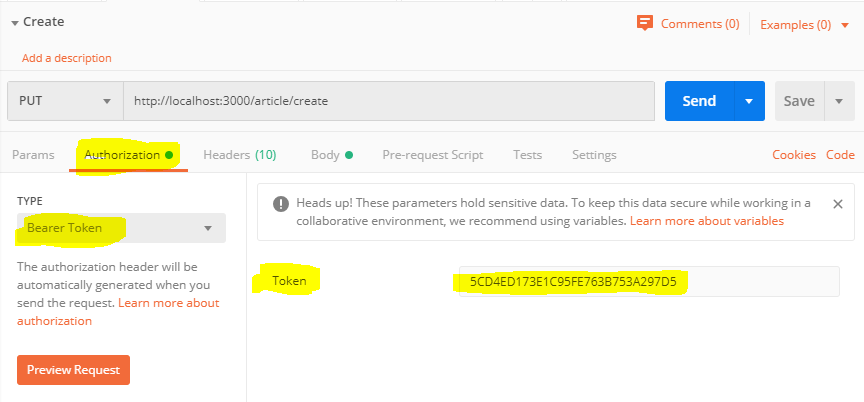

# Node API
Node API Example - Node | Express | MongoDB

# Task
Create a RESTful API that would allow an application to manage users and articles.

### User Model:
* _id
* name (String)
* avatar (Url)

### Article Model
* _id
* userId (User._id)
* title (string)
* text (string)
* tags (array of strings)

### Required endpoints:
* Create a new user
* Create a new article
* Edit an article
* Delete an article
* Return all articles (from all users) that contains the given tag(s) (1 or more)

## Authentication
This API will be private, used by a mobile app or server side applications so every call to the API will include an API token (example: 5CD4ED173E1C95FE763B753A297D5) to validate. 
Please indicate in the API documentation where in the request we should place that token. Note: for simplicity make the token an environment variable.

# Run project

Step 1 - Clone the project
```
git clone https://github.com/fabrizioamelotti/nodeapi.git
```

Step 2 - Go to the folder
```
cd nodeapi/
```

Step 3 - Install dependencies
```
npm install
```

Step 4 - Execute the project
```
npm start
```

# Set up the Authorization token in Postman

Set Bearer token: 5CD4ED173E1C95FE763B753A297D5



# Postman
Import file [NodeAPI-Postman](documentation/postman/GitHub-NodeAPI.postman_collection.json) to have all the URLs.

